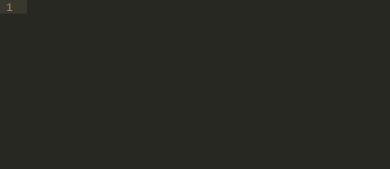

# Comment-Snippets for Sublime Text

Several snippets to create some fancy PHP, CSS and HTML comments in [Sublime Text](http://www.sublimetext.com/).



## Comments Examples

### HTML Comments

#### HTML Section

Tab trigger: `comm-html-section` + `tab`

```html
<!--========================================
=             Section comment              =
=========================================-->


<!--=====  End of Section comment  ======-->
```

#### HTML Section header

Tab trigger: `comm-html-header` + `tab`

```html
<!--========================================
=             Section comment              =
=========================================-->
```

#### HTML Section footer

Tab trigger: `comm-html-footer` + `tab`

```html
<!--=====  End of Section comment  ======-->
```

#### HTML Comment

Tab trigger: `comm-html` + `tab`

```html
<!-- html comment -->
```

### C-Style Comments

For languages supporting C-Style comments: PHP, CSS, Javascript, Java...

#### Section

Tab trigger: `comm-section` + `tab`


```css
/*=============================================
=            Section comment block            =
=============================================*/


/*=====  End of Section comment block  ======*/
```

#### Section Header

Tab trigger: `comm-section-header` + `tab`

```css
/*=============================================
=            Section comment block            =
=============================================*/
```

#### Section Footer

Tab trigger: `comm-section-footer` + `tab`

```css
/*=====  End of Section comment block  ======*/
```

#### Subsection

Tab trigger: `comm-subsection` + `tab`

```css
/*----------  Subsection comment block  ----------*/
```


#### Simple Comment

Tab trigger: `comm` + `tab`

```css
/* Comment */
```

#### Block Comment

Tab trigger: `comm-block` + `tab`

```css
/**
 *
 * Block comment
 *
 */
```

#### Todo Comment

Tab trigger: `comm-todo` + `tab`

```css
/**

    TODO:
    - First todo item
    - Second todo item

 */
```
